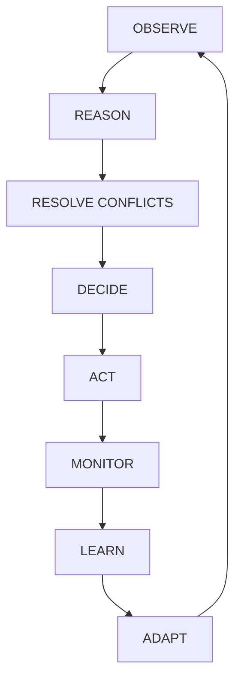
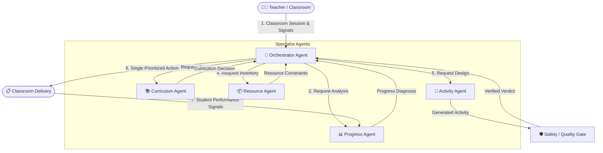

# 🪶 Saarthi

### AI Classroom Copilot — Autonomous Multi-Agent Classroom OS

> **Saarthi** is an autonomous multi-agent classroom operating system designed for teachers managing multi-grade classrooms simultaneously. By continuously observing classroom signals, reasoning about individual grade progress, reconciling curriculum priorities, checking physical resource availability, generating targeted learning activities, and verifying them through a strict safety gate, Saarthi reduces repetitive classroom coordination so teachers can focus on teaching.

> **Core Principle:** *"If Saarthi creates more work for the teacher, Saarthi has failed."*

---

[](https://www.python.org/)
[](https://github.com/strands-ai)
[](https://aws.amazon.com/bedrock/)
[](https://react.dev/)
[](https://tailwindcss.com/)
[](https://vitejs.dev/)
[](https://docs.pydantic.dev/)

---

## 🎯 The Problem

In many educational environments — particularly understaffed schools, rural learning centers, and composite classrooms — **a single teacher is forced to instruct multiple grades (e.g., Grades 3, 4, and 5) simultaneously**.

Each grade level and student group presents distinct challenges:
- **Divergent Mastery Levels**: Grade 3 may need foundational arithmetic practice while Grade 5 works on decimal multiplication.
- **Varying Trouble Spots**: Grade 4 may be stuck on simplifying fractions after a low-correctness assessment.
- **Competing Curriculum Demands**: Rigid schedules demand progress, but student gaps require immediate remediation.
- **Constraint-Bound Resources**: Only one projector, limited printed worksheets, or shared math manipulatives exist.
- **High Cognitive Overload**: The teacher spends crucial minutes managing transitions, grading papers, and deciding who does what next.

**Saarthi solves this by handling the complex multi-grade coordination autonomously.**

---

## 🔄 From Signals → Autonomous Decisions

Unlike conventional conversational chatbots that respond passively to individual prompts, Saarthi runs a **continuous, closed-loop classroom feedback cycle**:



1. **Observe**: Ingest real-time classroom assessment scores, student engagement, and teacher feedback.
2. **Reason**: Specialist agents evaluate student progress and curriculum requirements independently.
3. **Resolve Conflicts**: The Orchestrator resolves competing resource and time demands across grades.
4. **Decide**: Formulate a single, prioritized next action for the teacher.
5. **Act**: Generate verified, ready-to-deliver learning activities and materials.
6. **Monitor & Learn**: Capture new performance signals during activity execution.
7. **Adapt**: Dynamically alter the learning trajectory when trouble spots persist.

---

## 🏗️ Multi-Agent Architecture

Saarthi is powered by a decoupled multi-agent architecture built with the **Strands Agents SDK** and backed by **Amazon Bedrock** foundational models.



### Specialist Agent Responsibilities

| Agent | Core Question | Primary Responsibility |
| :--- | :--- | :--- |
| **🧠 Orchestrator Agent** | *"What should the classroom do right now?"* | Resolves multi-grade conflicts, manages turn execution, and commits final shared state mutations. |
| **📊 Progress Agent** | *"What is true about student learning?"* | Diagnoses mastery trends, identifies persistent trouble spots, and computes readiness scores. |
| **📚 Curriculum Agent** | *"What should happen next in the sequence?"* | Reconciles learning objectives against curriculum standards and decides whether to advance, hold, or remediate. |
| **📦 Resource Agent** | *"What can physically be delivered?"* | Filters recommendations against available classroom tools, devices, print materials, and teacher time. |
| **📝 Activity Agent** | *"What exact exercise will students complete?"* | Generates grade-tailored exercises, instructions, and rubrics matched to the specific medium. |
| **🛡️ Safety / Quality Gate** | *"Is this activity safe, correct, and appropriate?"* | Evaluates pedagogical accuracy, age suitability, and physical safety before any activity reaches students. |

<details>
<summary><b>🔍 Deep Dive: Agent Boundaries & Non-Responsibilities</b></summary>

<br />

#### 🧠 Orchestrator Agent
- **Inputs**: Active grade selection, teacher intent, specialist outputs.
- **Decision Authority**: Final conflict resolution across competing grade priorities; state mutation commitment.
- **Explicit Non-Responsibilities**: Does *not* generate raw activity text directly or evaluate pedagogical safety directly.

#### 📊 Progress Agent
- **Inputs**: Assessment scores, completion rates, error taxonomy logs.
- **Decision Authority**: Mastery status determination (`mastered`, `struggling`, `remediating`).
- **Explicit Non-Responsibilities**: Does *not* alter curriculum sequences or recommend physical classroom tools.

#### 📚 Curriculum Agent
- **Inputs**: Progress diagnosis, target curriculum standards, historical topic sequence.
- **Decision Authority**: Next topic target, pace adjustment (`advance`, `reinforce`, `remediate`).
- **Explicit Non-Responsibilities**: Does *not* write exercise prompts or resolve multi-grade resource contention.

#### 📦 Resource Agent
- **Inputs**: Physical inventory logs, available devices, time constraints.
- **Decision Authority**: Medium selection (`digital_tablet`, `print_worksheet`, `peer_group`, `blackboard`).
- **Explicit Non-Responsibilities**: Does *not* assess student cognitive performance or verify content safety.

#### 📝 Activity Agent
- **Inputs**: Reconciled curriculum goals, target grade level, assigned medium constraints.
- **Decision Authority**: Exact question formulation, answer keys, step-by-step student instructions.
- **Explicit Non-Responsibilities**: Does *not* alter global state or override safety verdicts.

#### 🛡️ Safety / Quality Gate
- **Inputs**: Candidate activity JSON output from Activity Agent.
- **Decision Authority**: Binary approval/rejection (`APPROVED`, `NEEDS_REVISION`, `REJECTED`) with safety score.
- **Explicit Non-Responsibilities**: Does *not* initiate new learning topics or re-plan schedules.

</details>

---

## 🗄️ Shared Classroom State

All agents operate over a single, deterministic **Shared Classroom State** schema stored in `data/classroom_state.json`.

To eliminate race conditions and inconsistent states, Saarthi enforces the **Single-Writer Principle**:
> *Specialist agents provide immutable recommendations; **only the Orchestrator Agent commits final mutations** to the Shared Classroom State.*

```json
{
  "session_id": "sess_multi_grade_001",
  "active_grades": ["3", "4", "5"],
  "grades": {
    "3": {
      "subject": "Mathematics",
      "current_topic": "Multiplication Concepts",
      "mastery_level": 0.78,
      "trouble_spots": ["array representation"],
      "curriculum_position": "Unit 3 - Lesson 2",
      "available_resources": ["printed_worksheets", "math_counters"]
    },
    "5": {
      "subject": "Mathematics",
      "current_topic": "Decimal Multiplication",
      "mastery_level": 0.42,
      "trouble_spots": ["simplifying final result"],
      "curriculum_position": "Unit 4 - Lesson 5",
      "available_resources": ["digital_tablets"]
    }
  }
}
```

---

## 🛣️ Golden Path Execution

Here is a concrete walkthrough of a multi-grade classroom cycle:

1. **Session Start**: The teacher initiates a 40-minute period for **Grades 3, 4, and 5**.
2. **Signal Ingestion**:
   - Grade 3: High mastery (88%), ready to advance.
   - Grade 4: Moderate mastery (72%), steady progress.
   - Grade 5: **Low mastery (42%)**, declining trend on Decimal Multiplication.
3. **Specialist Evaluation**:
   - `Progress Agent`: Flags Grade 5 persistent trouble spot — *"simplifying final decimal results"*.
   - `Curriculum Agent`: Recommends **Hold & Remediate** for Grade 5; **Advance** for Grade 3.
   - `Resource Agent`: Identifies digital tablets available for Grade 5, printed worksheets for Grade 3.
   - `Activity Agent`: Designs a targeted 10-minute decimal simplification practice for Grade 5.
4. **Safety Verification**:
   - `Safety Gate`: Analyzes activity content -> **PASS (Score: 0.98)**.
5. **Orchestrator Resolution**:
   - Prioritizes Grade 5 remediation as **CRITICAL**.
   - Assigns Grade 3 self-directed peer practice.
   - Delivers 1 single, clear action card to the teacher interface.

---

## ⚡ Saarthi Adapts: Before vs. After

When student signals change, Saarthi immediately adapts the plan without requiring teacher reconfiguration:

```
┌─────────────────────────────────────────────────────────────────────────────┐
│ BEFORE SIGNAL (Standard Track)                                             │
├─────────────────────────────────────────────────────────────────────────────┤
│ Grade 5 Target: Move to Decimal Division (Unit 4 - Lesson 6)               │
│ Action: Distribute new unit textbook chapter.                              │
└─────────────────────────────────────────────────────────────────────────────┘
                                      │
                   [ ⚠️ New Signal: 42% Assessment Score ]
                                      ▼
┌─────────────────────────────────────────────────────────────────────────────┐
│ AFTER SAARTHI ADAPTATION (Targeted Remediation)                             │
├─────────────────────────────────────────────────────────────────────────────┤
│ Progress Agent   --> Flags decline in decimal simplification.                │
│ Curriculum Agent --> Changes decision from ADVANCE to REMEDIATE.            │
│ Resource Agent   --> Selects 10-min interactive digital check.             │
│ Activity Agent   --> Generates "Decimal Place Value Fixer" activity.        │
│ Safety Gate      --> Approves exercise for accuracy & age suitability.      │
│ Orchestrator     --> Mutates state & displays priority action card.         │
└─────────────────────────────────────────────────────────────────────────────┘
```

---

## 🤖 Why Saarthi Is Truly Agentic

Saarthi goes beyond standard single-prompt LLM wrappers:

- **Strict Responsibility Separation**: Agents do not attempt to solve the whole problem at once; each agent performs specialized reasoning.
- **Tool Use & State Access**: Specialist agents invoke deterministic tools (`read_shared_state`, `get_active_grades`) to query ground truth.
- **Context & History Awareness**: Decisions depend on multi-turn performance trends rather than isolated inputs.
- **Cross-Grade Conflict Resolution**: The Orchestrator balances competing needs across multiple active grades.
- **Independent Safety Verification**: The Safety Gate acts as an autonomous circuit-breaker before activity delivery.

---

## 🛠️ Technology Stack

| Layer | Technology | Purpose |
| :--- | :--- | :--- |
| **Agent Framework** | [Strands Agents SDK](https://github.com/strands-ai) | Multi-agent lifecycle, tool invocation, and agent communication. |
| **LLM Provider** | [Amazon Bedrock](https://aws.amazon.com/bedrock/) | Foundational model reasoning and structured generation. |
| **Language & Runtime** | Python 3.10+ | Core agent loops, tools, state management, and test suites. |
| **Schema Validation** | Pydantic v2 | Strict data modeling for agent inputs/outputs and safety contracts. |
| **State Persistence** | JSON File Store | Deterministic shared classroom state (`data/classroom_state.json`). |
| **Web Interface** | React 19 + Vite 8 | Apple-inspired Liquid Glass UI dashboard for teacher monitoring. |
| **Styling Engine** | Tailwind CSS v4 | Custom design system tokens and glassmorphism styling primitives. |
| **Localization** | Custom i18n | Support for 7 regional languages (EN, HI, GU, MR, KN, TE, TA). |

---

## 📂 Project Structure

```text
saarthi-agents/
├── agents/                     # Specialist Agent implementations
│   ├── activity_agent.py       # Activity generation specialist
│   ├── curriculum_agent.py     # Curriculum reconciliation specialist
│   ├── orchestrator_agent.py   # Multi-grade conflict resolution & state manager
│   ├── progress_agent.py       # Student mastery diagnosis specialist
│   ├── resource_agent.py       # Physical resource recommendation specialist
│   └── safety_gate.py          # Quality and safety verification gate
├── tools/                      # Deterministic Agent Tools
│   ├── activity_tools.py       # Activity lookup and formatting utilities
│   ├── curriculum_tools.py     # Curriculum database query tools
│   ├── orchestrator_tools.py   # Shared state read/write & grade tools
│   ├── progress_tools.py       # Progress calculation & diagnosis tools
│   ├── resource_tools.py       # Resource availability lookup tools
│   └── safety_tools.py         # Safety rule evaluation tools
├── data/                       # Ground Truth JSON Datasets
│   ├── activity_data.json      # Activity templates and exemplars
│   ├── classroom_state.json    # Active shared classroom state store
│   ├── curriculum_data.json    # Grade-level learning standards & sequences
│   ├── resource_data.json      # Classroom equipment & material inventory
│   └── safety_data.json        # Pedagogical safety policies & rules
├── classroom_loop.py           # Core multi-turn autonomous classroom execution loop
├── test_activity_agent.py      # Unit tests for Activity Agent
├── test_classroom_loop.py      # Integration tests for execution loop
├── test_curriculum_agent.py   # Unit tests for Curriculum Agent
├── test_end_to_end.py          # Full system end-to-end evaluation
├── test_orchestrator_agent.py  # Unit tests for Orchestrator Agent
├── test_progress_agent.py      # Unit tests for Progress Agent
├── test_resource_agent.py      # Unit tests for Resource Agent
├── test_safety_gate.py         # Unit tests for Safety Gate
├── .gitignore                  # Git exclusion rules
├── README.md                   # Project documentation
└── web/                        # Web Dashboard Application
    └── frontend/               # React 19 + Vite + Tailwind CSS v4 web UI
        ├── src/
        │   ├── components/     # AppShell, AppSidebar, TopHeader, Liquid Glass UI
        │   ├── i18n/           # Multi-language translation dictionary (7 scripts)
        │   └── index.css       # Liquid Glass material design system tokens
        ├── package.json        # Node.js dependencies
        └── vite.config.js      # Vite build configuration
```

---

## 💻 Running Saarthi Locally

### Prerequisites
- **Python 3.10+**
- **Node.js 18+** & **npm** (for frontend)
- **AWS Credentials** configured with Amazon Bedrock access (if running live LLM inference)

### 1. Environment Setup

```bash
# Clone the repository
git clone https://github.com/harshilrajyaguru/Saarthi.git
cd Saarthi

# Create and activate virtual environment
python -m venv .venv

# On Windows (PowerShell):
.venv\Scripts\Activate.ps1
# On Linux/macOS:
source .venv/bin/activate

# Install Python dependencies (Strands SDK, Pydantic, etc.)
pip install strands-agents pydantic
```

### 2. AWS / Bedrock Credentials (Optional for LLM Mode)

Set your AWS credentials in your environment or credentials file:

```bash
export AWS_ACCESS_KEY_ID="your-access-key"
export AWS_SECRET_ACCESS_KEY="your-secret-key"
export AWS_DEFAULT_REGION="us-east-1"
```

> *Note: Saarthi's test suites and agent logic include deterministic fallback execution modes so core system verification runs cleanly even without active AWS credentials.*

### 3. Run Autonomous Classroom Loop

```bash
python classroom_loop.py
```

### 4. Run Frontend Dashboard

```bash
# Navigate to web frontend directory
cd web/frontend

# Install dependencies
npm install

# Start local development server
npm run dev
```

Open `http://localhost:5173` in your browser to view the **Liquid Glass Teacher Dashboard**.

---

## 🧪 Verification & Test Suite

Saarthi includes comprehensive test coverage verifying every individual specialist agent, tool invocation, safety verdict, and the end-to-end multi-grade orchestration loop.

Run all test suites using `pytest` or Python:

```bash
# Run individual agent test suites
python test_progress_agent.py
python test_curriculum_agent.py
python test_resource_agent.py
python test_activity_agent.py
python test_safety_gate.py
python test_orchestrator_agent.py

# Run autonomous loop integration test
python test_classroom_loop.py

# Run full system end-to-end verification
python test_end_to_end.py
```

<details>
<summary><b>📋 Verified Test Suite Summary</b></summary>

<br />

| Test Module | Coverage Focus | Result |
| :--- | :--- | :---: |
| `test_progress_agent.py` | Mastery level computation, trend analysis, trouble spot identification | **PASS** |
| `test_curriculum_agent.py` | Objective alignment, advance/hold/remediate decision logic | **PASS** |
| `test_resource_agent.py` | Medium matching, equipment inventory constraints, time budgeting | **PASS** |
| `test_activity_agent.py` | Exercise generation, rubric structure, medium formatting | **PASS** |
| `test_safety_gate.py` | Content safety checks, age appropriateness, safety scoring | **PASS** |
| `test_orchestrator_agent.py` | Cross-grade conflict resolution, priority action selection, state mutation | **PASS** |
| `test_classroom_loop.py` | Multi-turn closed-loop execution, signal processing, adaptation cycles | **PASS** |
| `test_end_to_end.py` | Full multi-agent orchestration pipeline validation | **PASS** |

</details>

---

## 💎 Design Principles

- **Teacher-First**: Eliminate administrative overhead rather than introducing another complex dashboard to configure.
- **Strict Agent Boundaries**: Each specialist owns exactly one reasoning domain.
- **Evidence Before Intervention**: Require multi-turn signal history before altering learning pathways.
- **Safe Execution**: Every generated exercise passes an independent safety gate before delivery.
- **Continuous Adaptation**: Dynamically alter strategies as real-time classroom signals arrive.
- **Multi-Grade Support**: Built from the ground up to support composite classrooms across Grades 1–8.

---

## 🌟 Why It Matters

- **Composite Classrooms**: In rural and under-resourced regions, over 30% of schools operate multi-grade classrooms. Saarthi gives single teachers the support of a full assistant team.
- **Reduced Burnout**: Automates exercise selection, grading criteria generation, and session planning.
- **Equity in Education**: Ensures students who fall behind receive immediate targeted remediation without slowing down advanced peers.

---

## 🛞 11-Step Demo Flow for Judges

```text
 1. 🚀 Start Session       --> Teacher launches period selecting Grades 3, 4 & 5.
 2. 📊 Read State          --> Saarthi loads historical progress & active inventory.
 3. 🔍 Diagnose Progress   --> Progress Agent flags Grade 5 decimal multiplication drop.
 4. 📚 Reconcile Goal      --> Curriculum Agent issues HOLD & REMEDIATE for Grade 5.
 5. 📦 Match Resources     --> Resource Agent selects digital tablets for Grade 5.
 6. 📝 Design Activity     --> Activity Agent generates "Decimal Place Value Fixer".
 7. 🛡️ Verify Safety       --> Safety Gate approves activity with 0.98 score.
 8. 🧠 Resolve Conflicts   --> Orchestrator prioritizes Grade 5 as CRITICAL action.
 9. 📋 Action Card Delivered--> Teacher receives single prioritized action card.
10. 📈 Ingest Signal       --> Student completes activity; new score arrives.
11. 🔄 Adapt Plan          --> Saarthi updates state and prepares next grade step.
```

---

<details>
<summary><b>🚀 Future Roadmap</b></summary>

<br />

- [ ] **Voice Signal Ingestion**: Real-time microphone audio processing for classroom engagement level detection.
- [ ] **AWS Bedrock AgentCore Deployment**: Production deployment using AWS AgentCore serverless architecture.
- [ ] **Expanded Curriculum Standards**: Out-of-the-box support for NCERT, CBSE, and US Common Core state standards.
- [ ] **Physical Hardware Integration**: Smart paper camera scanning for instant worksheet grading.
- [ ] **Offline Edge Mode**: On-device lightweight model execution for remote rural schools without internet connectivity.

</details>

---

*Built with ❤️ for teachers everywhere.*